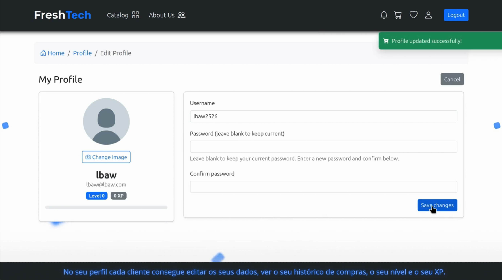

# PA: Product and Presentation

## A9: Product

The final version of FreshTech is the result of the implementation of the all the previous stages (A1 to A7) we have done during the semester. It uses PHP and Laravel to create dynamic web pages, AJAX for better UX and PostgreSQL for the database.

The main goal of our project is the development of a e-commerce platform with the purpose of providing an online shopping experience for tech products. It is a platform that can be used by anyone looking to purchase tech products. After signing up and creating an account, users can browse products, add items to their cart, write reviews, and make item purchases!

### 1. Installation

The release with the final version of the source code is available in our [repository](https://gitlab.up.pt/lbaw/lbaw2526/lbaw2526/-/tags), in PA tag.

Full Docker command to start the image available in the group's Gitlab Container Registry using the production database:

```
docker run -d --name lbaw2526 -p 8001:80 gitlab.up.pt:5050/lbaw/lbaw2526/lbaw2526
```

### 2. Usage

#### 2.1. Administration Credentials

| Email | Password |
|-------|----------|
| admin@shop.com | admin123 |

#### 2.2. User Credentials

| Type | Email | Password |
|------|-------|----------|
| Regular Buyer | buyer1@shop.com | buyer123 |
| Regular Buyer | buyer2@shop.com | buyer456 |

IMPORTANT: Mailtrap's sandbox credentials for password recovery testing can be found on `.env`

```properties
MAIL_MAILER=smtp
MAIL_HOST=sandbox.smtp.mailtrap.io
MAIL_PORT=2525
MAIL_USERNAME=2972d06abd7068
MAIL_PASSWORD=2082e4ac66a256
MAIL_ENCRYPTION=TLS

MAIL_FROM_ADDRESS=FreshTech@lbaw.com
MAIL_FROM_NAME=FreshTech
```

### 3. Application Help

> Describe where help has been implemented, pointing to working examples.

Along with the main features of our website we also made sure to include as many helping features as possible, mainly:

* Input form placeholders, these should help the users know what we want them to fill up on any form they are presented with:

  {width="379" height="534"}
* We also made sure to alert users for any mistakes they may make and made sure to let them know when things go as expected!

  {width="774" height="551"}

  {width="886" height="600"}

### 4. Input Validation

> Describe how input data was validated, and provide examples to scenarios using both client-side and server-side validation.

**Server-side validation examples:**

* Profile editing ensures certain rules:

```php
public function editProfile(Request $request)
    {
        $user = Auth::user();
        $buyer = $user->buyer;
        Gate::authorize('editProfile', $buyer);
        // Only allow changing email and password for non-OAuth users
        $isOauth = !empty($user->google_id);

        // Validation rules (password can't be less than 8 for example)
        $rules = [];
        if ($request->filled('user_name')) {
            $rules['user_name'] = 'string|max:255';
        }
        if ($request->filled('password') && !$isOauth) {
            $rules['password'] = 'string|min:8|confirmed';
        }
        // ....
     }
```

* File upload for profile picture support also ensures certain rules:

```php
function upload(Request $request) {

        // Validation: has file
        if (!$request->hasFile('file')) {
            return redirect()->back()->with('error', 'Error: File not found');
        }

        // Validation: upload type
        if (!$this->isValidType($request->type)) {
            return redirect()->back()->with('error', 'Error: Unsupported upload           type');
        }

        // Validation: upload extension
        $file = $request->file('file');
        $type = $request->type;
        $extension = $file->extension();
        if (!$this->isValidExtension($type, $extension)) {
            return redirect()->back()->with('error', 'Error: Unsupported upload extension');
        }
        // ...
}
```

**Client-side validation examples:**

* Javascript validates the checkout form inputs (checks if all the required elements are present)

```php
function updateVisibility() {
    const selected = document.querySelector('input[name="payment_method"]:checked')?.value || 'card';
    if (selected === 'card') {
      cardFields.classList.remove('d-none');
      phoneField.classList.add('d-none');
      // set required on card inputs
      document.getElementById('card_name').required = true;
      document.getElementById('card_number').required = true;
      document.getElementById('card_expiry').required = true;
      document.getElementById('card_cvc').required = true;
      document.getElementById('phone').required = false;
    } else {
      cardFields.classList.add('d-none');
      phoneField.classList.remove('d-none');
      document.getElementById('card_name').required = false;
      document.getElementById('card_number').required = false;
      document.getElementById('card_expiry').required = false;
      document.getElementById('card_cvc').required = false;
      document.getElementById('phone').required = true;
    }
  }
```

* HTML validates several inputs, for example the login/register forms

```php
<div class="mb-3">
     <label for="email" class="form-label small">E-mail</label>
     <input
          id="email"
          name="email"
          type="email"
          value="{{ old('email') }}"
          required
          autofocus
          inputmode="email"
          autocomplete="email"
          class="form-control form-control-sm"
<!-- ... -->
```

### 5. Check Accessibility and Usability

Accessibility: https://ux.sapo.pt/checklists/acessibilidade/ Accessibility results: [AcessibilityTests.pdf](https://gitlab.up.pt/lbaw/lbaw2526/lbaw2526/-/blob/main/docs/Checklist%20de%20Acessibilidade%20-%20SAPO%20UX.pdf) (16/18)

Usability: https://ux.sapo.pt/checklists/usabilidade/ Usability results: [UsabilityTests.pdf](https://gitlab.up.pt/lbaw/lbaw2526/lbaw2526/-/blob/main/docs/Checklist%20de%20Usabilidade%20-%20SAPO%20UX.pdf) (25/28)

### 6. HTML & CSS Validation

HTML: [HTML-Validator.pdf](https://gitlab.up.pt/lbaw/lbaw2526/lbaw2526/-/blob/main/docs/HTML-Validator.pdf)

CSS: [HTML-Validator.pdf](https://gitlab.up.pt/lbaw/lbaw2526/lbaw2526/-/blob/main/docs/CSS-Validator.pdf)

### 7. Revisions to the Project

During the project there were significant revisions on the previous deliveries:

1. Database was changed to support some functionalities (promotions, images), some were small changes, but others were complete tables.
2. OpenAPI file was refactored to be according to the paths in the project and to add new ones that weren't specified in the EAP delivery.

### 8. Implementation Details

#### 8.1. Libraries Used

Apart from the regular libraries we got from the initial setup, we used some others, mainly recommended by the professors on the `Laravel Integrations` tutorials.

* **Laravel Socialite -** library used for the Google OAuth, this library along with Google Cloud helped us set up the authentication. Usage examples can be found on [GoogleOAuthController.php](https://gitlab.up.pt/lbaw/lbaw2526/lbaw2526/-/blob/main/app/Http/Controllers/Auth/GoogleOAuthController.php?ref_type=heads).
* **Pusher PHP -** library used for the push notifications, this library along with AJAX lets us have real time notifications without the need to refresh the browser. Usage examples can be found on [app.blade.php](https://gitlab.up.pt/lbaw/lbaw2526/lbaw2526/-/blob/main/resources/views/layouts/app.blade.php?ref_type=heads) (notifications from line 140 onwards).

Many others that were expected such as Bootstrap for the styling (found in any viewer), Vite for the frontend assets such as images, PostgreSQL for the database and others present in the initial setup.

#### 8.2 User Stories

- Prototype implementations

| US Identifier | Name | Module | Priority | Team Members | State |
|---------------|------|--------|----------|--------------|-------|
| US01 | Products List | M02: Stock Management | High | **Tiago Cunha** | 100% |
| US02 | Product Categories | M02: Stock Management | High | **Tiago Cunha** | 100% |
| US03 | Search Products | M02: Stock Management | High | **Vasco Gonçalves** | 100% |
| US04 | Product Details | M02: Stock Management | High | **Tiago Cunha** | 100% |
| US05 | Product Reviews | M03: Reviews & Wishlist | High | **Catarina Bastos** | 100% |
| US06 | Shopping Cart | M04: Shopping Cart & Checkout | High | **João Júnior** | 100% |
| US07 | Sign-up | M01: Authentication & User Profile | High | **Vasco Gonçalves** | 100% |
| US08 | Log-in | M01: Authentication & User Profile | High | **Vasco Gonçalves** | 100% |
| US11 | Checkout | M04: Shopping Cart & Checkout | High | **João Júnior** | 100% |
| US18 | Track Order | M04: Shopping Cart & Checkout | High | **João Júnior** | 100% |
| US19 | Cancel Order | M04: Shopping Cart & Checkout | High | **Tiago Cunha** | 100% |
| US22 | Manage Products | M02: Stock Management | High | **Catarina Bastos** | 100% |
| US23 | Manage Product Stock | M02: Stock Management | High | **Catarina Bastos** | 100% |
| US26 | Manage Order Status | M05: Administration & Static Pages | High | **Catarina Bastos** | 100% |

- Final Product implementations

| US Identifier | Name | Module | Priority | Team Members | State |
|---------------|------|--------|----------|--------------|-------|
| US09 | OAuth API Sign-up | M01: Authentication & User Profile | Low | **Tiago Cunha** | 100% |
| US10 | OAuth API Login | M01: Authentication & User Profile | Low | **Tiago Cunha** | 100% |
| US12 | Purchase History | M04: Shopping Cart & Checkout | Medium | **João Júnior** | 100% |
| US13 | Review | M03: Reviews & Wishlist | Medium | **Catarina Bastos** | 100% |
| US14 | Wishlist | M03: Reviews & Wishlist | Medium | **João Júnior** | 100% |
| US15 | Report Review | M03: Reviews & Wishlist | Low | **Vasco Gonçalves** | 100% |
| US16 | Edit Review | M03: Reviews & Wishlist | Medium | **Catarina Bastos** | 100% |
| US17 | Remove Review | M03: Reviews & Wishlist | Medium | **Vasco Gonçalves** | 100% |
| US20 | Level system | M04: Shopping Cart & Checkout | Medium | **Vasco Gonçalves** | 100% |
| US21 | Notifications | M04: Shopping Cart & Checkout | Medium | **João Júnior** | 100% |
| US24 | Manage Product Categories | M02: Stock Management | Medium | **Catarina Bastos** | 100% |
| US25 | View Purchase Histories | M05: Administration & Static Pages | Medium | **Tiago Cunha** | 100% |
| US27 | Manage Reports | M05: Administration & Static Pages | Low | **Vasco Gonçalves** | 100% |

---

## A10: Presentation

### 1. Product presentation

FreshTech is an online shop for customers who seek a reliable and convenient way to purchase tech products. The main goal of this project is the development of a web-based store that enables the management and sale of tech products.

The system covers all of the shop’s operations: searching and browsing products and categories, a big catalog of items with several filters to help user search, managing a shopping cart and wishlist, tracking orders, viewing purchase history, profile editing and leaving product reviews. Not only this but to ensure client loyalty we have implemented a XP/Level design so that the more purchases a customer makes the best promotions they get. Our system also has built-in administrative features such as: managing categories, promotions and client's orders status.

### 2. Video presentation

The following link leads up to a **Video Demo** regarding the product, it is only composed by quick clips of various functionalities and a **text context** bellow that gives a quick explanation on the current screen being displayed

## 

## [Video Demonstration](https://github.com/user-attachments/assets/e4161bbd-4747-440b-b9fa-b67613e2a0ba)


## Revision history

Changes made to the first submission:

1. Item 1
2. ..

---

GROUP2526, 22/12/2025

* Catarina Loureiro de Bastos, up202307631
* João Rodrigues Alberton Júnior, up2023067219
* Tiago Mota Cunha, up202305564 (editor)
* Vasco Miguel Fidalgo Martins Gonçalves, up202305513


